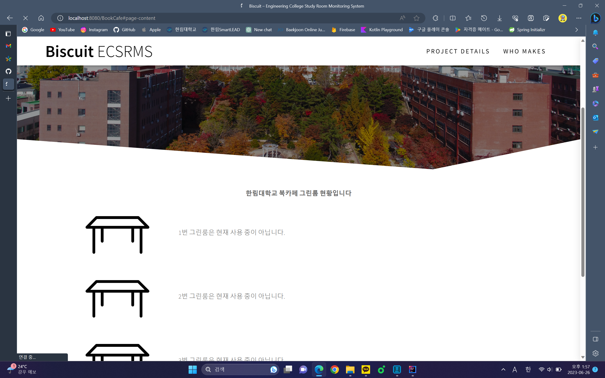

# Tableing
2022년 한림대학교 소프트웨어학부 학술제 [서공제] 본선 진출 작품
## 개요
&nbsp;한림대학교 공학관의 스터디룸 및 멘토링실 실시간 좌석 현황 시스템으로 정문과 비교적 거리가 있는 공학관이다. 시험기간 및 프로젝트 기간에 사용률이 급증하여 자리 싸움 및 불필요한 언쟁이 발생하는 것을 방지하는 목적을 가지고 있다. 해당 프로젝트로 공학관 내 학업 자리를 실시간으로 확인하여 스터디룸 및 멘토링실 방문 경쟁을 최소화하여 싸움 및 언쟁을 줄일 수 있도록, 편리함을 느낄 수 있는 목적을 가지고 있다.
## 개발 환경
* Java
* Spring boot
* IntelliJ
* MySQL Server
* BLE Beacon
* Python
## 실행 요약
&nbsp;스터디룸 이용자는 해당 스터디룸을 사용하는 의미로 BLE Beacon을 켜준다. Beacon은 Receiver에게 통신하여 받은 데이터를 MySQL DB로 전달한다. 또한 전달 받은 데이터를 실시간으로 웹페이지에 갱신시켜 다른 사용자는 해당 스터디룸, 멘토링실이 사용 중이라는 것을 확인할 수 있다.

실행 사진: 북카페 스터디룸을 아무도 사용하지 않았을 때   
   
사용자가 Beacon을 누르고 해당 멘토링실을 사용하면 실시간 좌석 현황 웹 페이지에 빈 책상 아이콘에서 사용자가 사용 중인 아이콘으로 바뀌게 된다.
